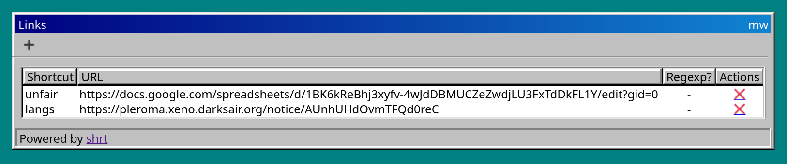

= Shrt

A naively simple URL shortener

== Installation

Only *NIX systems are supported.

Runtime dependencies:

- cURL
- OpenSSL
- SQLite

Build dependencies:

- CMake
- A C++23 compiler

=== Building from source

1. Clone the repo
2. Go into the repo directory, and run `cmake -B build`.
3. Run `cmake --build build -j`.
4. Pick a data directory where the database will be created.
5. Copy the `templates` and `statics` directories into the data
directory.
6. Copy `build/shrt` into any directory that is in your `$PATH`.

=== Using pre-build binary

1. Download the binary from one of the releases.
2. Extract the downloaded tarball.
3. Continue to step 4 in “Building from source”.

=== Arch Linux package

A PKGBUILD is provided in `packages/arch` in this repository.

== Configuartion

By default, shrt looks for a configuration file at `/etc/shrt.yaml`.
This path can be changed with the `-c` command line option. An example
configuration file is printed below with comments.

[source,yaml]
----
# Specify the data directory you have picked.
data-dir: "/var/lib/shrt"
# The listening address. Example: localhost, 0.0.0.0, 127.0.0.1.
listen-address: localhost
# The port to listen to. If this is 0, the value of “listen-address”
# is treated as a path of a UNIX domain socket file.
listen-port: 8080
# The client ID of your shrt service. This is given by the OpenID
# Connect provider.
client-id: shrt
# The client secrete of your shrt service. This is given by the OpenID
# Connect provider.
client-secret: "abced12345"
# The initial URL of the OpenID Connect service.
openid-url-prefix: "https://auth.example.com/"
# The base URL of your shrt service. This is usually just “https://”
# followed by your domain name.
base-url: https://go.mws.rocks
----

=== Authentication

Shrt relies on an external OpenID Connect service provider for
authentication. Usually you register your instance of shrt to the
OpenID Connect provider. The provider will give you an client ID and a
client secret (in this case your shrt server is the “client” of the
OpenID Connect service). An OpenID Connect service has a number of
endpoints, such as user info, tokens, etc. The URLs of those endpoints
are discover by visiting a URL that is constructed from the URL in the
configuration option `openid-url-prefix`, followed by
`.well-known/openid-configuration`. For example, if you set
`openid-url-prefix` to be `https://auth.example.com/`, the resulting
URL would be

----
https://auth.example.com/.well-known/openid-configuration
----

This method works on KeyCloak, but I have never tested this on other
OpenID Connect providers.

=== Base URL and shortcuts

For the configuration option `base-url`, usually this is just
`https://` followed by a domain that you own. Supposed you create a
shortcut called “search” which points to `https://google.com`, you
would be able to visit `https://your.domain/search` and be redirected
to `https://google.com`. However you do not have to use a root URL
under your domain. If you set `base-url` to
`https://your.domain/some/path`, your shortcut would be at
`https://your.domain/some/path/search`. I do not know why anybody
would want this, but the capability is there.
